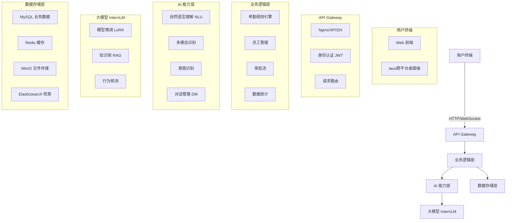
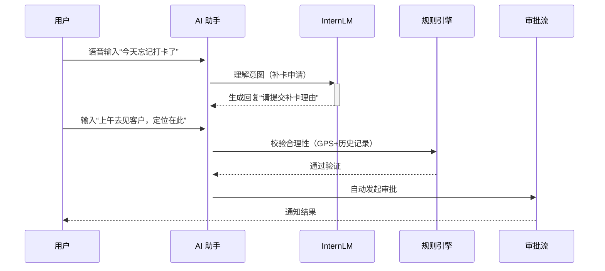
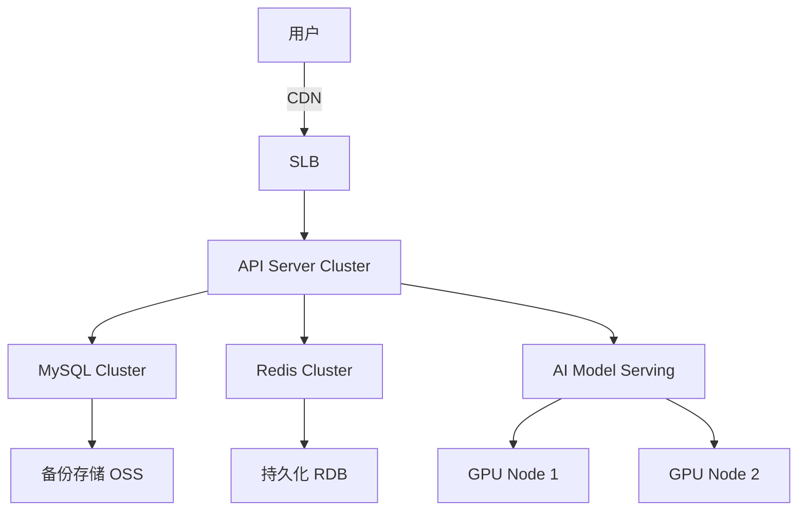

🎉 **基于InternLM的智慧考勤助手** 的技术架构图、方案设计及关键技术说明。

---

## **1. 技术架构图（分层设计）**

---

## **2. 核心模块说明**
### **（1）用户终端**
- **Web 前端**：Vue3/React + Ant Design，提供管理后台。
- **移动端**：React Native，支持扫码、GPS 打卡、语音交互。

### **（2）API Gateway**
- **认证鉴权**：JWT + OAuth2.0。
- **流量控制**：限流、熔断（Sentinel）。
- **协议转换**：RESTful/WebSocket → 后端服务。

### **（3）业务逻辑层**
| 模块          | 功能说明                          | 技术实现                |
|---------------|----------------------------------|-------------------------|
| 考勤规则引擎   | 弹性工时、排班、异常检测          | Drools 规则引擎         |
| 员工管理       | 组织架构、权限角色                | RBAC 模型               |
| 审批流         | 请假/补卡流程自动化               | Activiti 工作流         |
| 数据统计       | 可视化报表（出勤率、迟到分析）     | Apache Superset         |

### **（4）AI 能力层**
| 模块          | 功能说明                          | 技术实现                |
|---------------|----------------------------------|-------------------------|
| 自然语言理解   | 处理用户语音/文本请求（如“我要请假”） | InternLM + 微调         |
| 多模态识别     | 人脸识别、活体检测、GPS 定位校验   | OpenCV + 腾讯云 API      |
| 意图识别       | 分类用户请求（打卡、查询、审批）    | BERT + Finetune         |
| 对话管理       | 多轮对话上下文维护                | Rasa + 状态机           |

### **（5）大模型 InternLM 集成**
- **模型微调**：使用 LoRA 在考勤场景数据（如请假条、打卡日志）上微调。
- **知识库（RAG）**：对接企业制度文档（PDF/Excel），实现问答检索。
- **行为预测**：分析历史数据，预测迟到风险并提前提醒。

### **（6）数据存储层**
| 存储类型       | 用途                              | 技术选型                |
|---------------|----------------------------------|-------------------------|
| MySQL         | 核心业务数据（员工、考勤记录）     | 主从集群 + 分库分表      |
| Redis         | 高频访问缓存（今日打卡状态）       | 哨兵模式                |
| MinIO         | 文件存储（人脸图片、语音记录）      | 分布式存储               |
| Elasticsearch | 日志和检索（“搜索某员工打卡记录”）  | IK 分词 + 聚合查询       |

---

## **3. 关键技术方案**
### **（1）考勤流程智能化**

### **（2）性能优化**
- **模型加速**：vLLM 推理引擎 + TensorRT 部署 InternLM。
- **缓存策略**：Redis 缓存高频查询（如部门员工列表）。
- **异步处理**：Celery 处理耗时任务（如报表生成）。

### **（3）安全设计**
- **数据加密**：传输层 TLS 1.3，存储层 AES-256。
- **隐私保护**：人脸数据脱敏（仅存储特征向量）。
- **防攻击**：IP 限速 + 人机验证（CAPTCHA）。

---

## **4. 部署架构（高可用方案）**

---

## **5. 扩展性设计**
- **插件化架构**：通过 Webhook 对接第三方 HR 系统。
- **多模型支持**：InternVL3-14B大模型。
- **边缘计算**：在分支机构部署轻量级模型。

